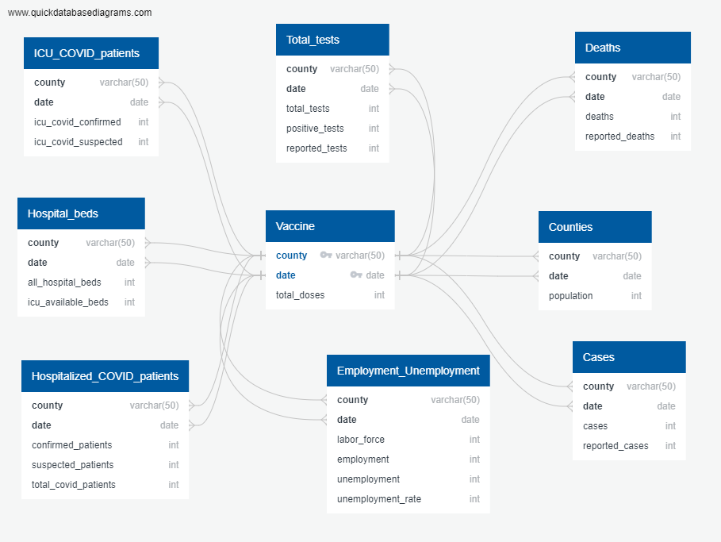
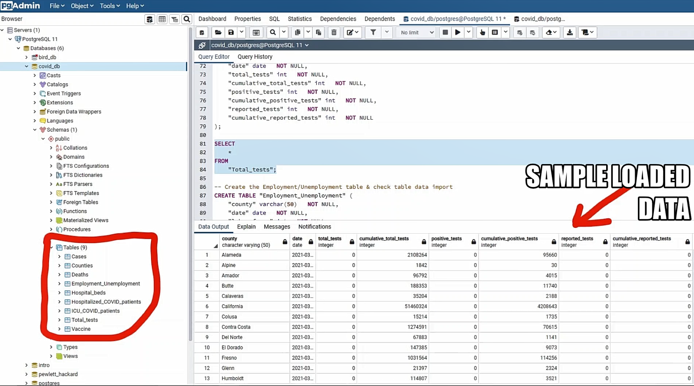

# COVID-19 ETL PROJECT

<h1><strong>  The Pretentious Pugs Group</strong> <h3><emp> MEMBERS:  Ellis Mok  |  Katherine Matovic  |  Ricky Kong  |  Silva MK </emp></h3></h1>

## SUBJECT OF DATA EXPLORATION
## COVID-19 vaccinations, test cases, hospitalizations, mortality and unemployment  in California Counties

## MAIN OBJECTIVES
<ul>
    <li> To collect COVID-19 data from two different sources that are maintained periodically, preferably managed by government or API sources that collect government data </li>
    <li>To perform cleaning, merging, filtering, normalization and aggregations of all the data being used</li>
    <li>To upload the files in a database in preparation for more thorough analysis</li>
    <li>To formulate ideas on what types of questions or analyses can be drawn from the datasets</li>
</ul>

## DATA SOURCES
<ul>
<li>California Health and Human Services Open Data Portal - For COVID-19 data </li>
    <ul>
    <li>website: <a href="https://data.chhs.ca.gov/" >https://data.chhs.ca.gov/</a></li>
    <li>covid19vaccinesbycounty.csv</li>
    <li>covid19hospitalbycounty.csv</li>
    <li>covid19cases_test.csv</li>
    </ul>
<li>Socrata Open Data API (SODA) -  For Employment/Unemployment data </li>
    <ul>
    <li>website: <a href="https://data.edd.ca.gov/Labor-Force-and-Unemployment-Rates/Local-Area-Unemployment-Statistics-LAUS-/e6gw-gvii" >https://data.edd.ca.gov/Labor-Force-and-Unemployment-Rates/Local-Area-Unemployment-Statistics-LAUS-/e6gw-gvii</a></li>
    <li> employment_dataset.csv
    </ul>
</ul> 

## DATA DESCRIPTIONS
<ol> 
<li> COVID-19 Vaccine Data - covid19vaccinesbycounty.csv</li>
    <ul>
    <li>There were <strong>5,212 total records</strong> collected from <strong>December 15, 2020 through March 16, 2021</strong>. The total number of doses administered per county in CA has been recorded daily.</li>
    <li>In the vaccine raw data, there were  county records named “Outside California” and “Unknown”. Based on CHHS Open Data Portal, these records are non-California residents who received vaccinations in a specific CA county. We will include these data records since the prospective analysis is focused on the number of doses each county has administered. </li>
    </ul>
<li> COVID-19 Hospitalization Data - covid19hospitalbycounty.csv</li>
    <ul>
    <li>There were <strong>19,709 total records</strong> collected from <strong>March 29, 2020 through March 15, 2021</strong>. The following data were collected for each county on a daily basis:
        <ul>
        <li>the number of hospitalized confirmed & suspected COVID-19 patients</li>
        <li>the number of ICU confirmed & suspected COVID-19 patients</li>
        <li>the number of ICU available beds</li>
        <li>the number of hospitalized COVID-19 patients  (missing data from March 29, 2020 through April 20, 2020)</li>
        <li>the number of all hospital beds per county (missing data from March 29, 2020 through April 20, 2020)</li>
        </ul>
</li>
    </ul>
<li>COVID-19 Test Cases Data - covid19cases_test.csv</li>
    <ul>
        <li>There were <strong>26,901 total records</strong> collected from <strong>January 1, 2020 through  March 16, 2021</strong>. The number of test cases are recorded for each county on a daily basis with the most recent dates added at the top of the table. The following data were collected for each county per day:
        </li>
        <ul>
            <li>area or county name </li>
            <li>area type</li>
            <li>the number of population by county</li>
            <li>total number of new & cumulative </li>
                <ul>
                <li>laboratory-confirmed COVID-19 cases</li>
                <li>confirmed COVID-19-related deaths</li>
                <li>PCR tests performed by laboratories</li>
                <li>PCR tests with positive results</li>
                <li>reported cases to the CA Department of Public Health</li>
                <li>reported deaths to the CA Department of Public Health</li>
                <li>reported PCR tests</li>
                </ul>
        </ul>        
    <li>There were some negative numbers in the column “reported_deaths”. Based on the CHHS Open Data Portal field documentation, these were corrections from the previous day’s report (i.e. if the cause of death was determined to be non-COVID related)</li>
    </ul>
    
<li>Employment/Unemployment Data - employment_dataset.csv</li>
<ul>
    <li>There were <strong>26,000 data</strong> extracted from Socrata API from <strong>April 2004 through January 2021</strong>. The following data were collected for each county per <stong>month</strong>:</li>
        <ul>
            <li>number of labor force</li>
            <li>number of employment and unemployment</li>
            <li>unemployment rate</li>
        </ul>

<li> The data in columns record count, area_type, year, month, and status_preliminary_final were were not used. Therefore, these columns were <strong>deleted</strong>.</li>

<li>There were negative numbers in the column “reported_deaths”. Based on the CHHS Open Data Portal field documentation, these were corrections from the previous day’s report (i.e. if the cause of death was determined to be non-COVID related)</li>
</ul>
</ol>

## ASSUMPTIONS & LIMITATIONS
<ul>
<li>All COVID data include only 2020 to 2021. Employment and unemployment data were narrowed down to only include these years.</li>
<li>The datasets are limited to the time fram they were reported as indicated in the data descriptions.</li>
</ul>

## ETL Methodologies

## A. DATA EXTRACTION 

<ol>
    <li>Downloaded three CSV datasets related to vaccines, hospitalizations and test cases by county level from the California Health and Human Services Open Data Portal
    </li>
    <li>Collected EDD employment/unemployment data using API extraction via Socrata Open Data API</li>
    
</ol>

## B. DATA TRANSFORMATION (Python & Pandas)

<ol>
    <li><strong>Data Cleaning & Filtering</strong></li>
        <ul>
            <li>Dataset1: covid19vaccinesbycounty.csv </li>
                <ul>
                    <li>The column “california_flag” contains “California” or “Not in California”. This colimn is not necessary to keep because all counties are in CA and the records with “Not in California” were already categorized in the county column  as “Outside California” and “Unknown”. Therefore, this column has been deleted.</li>
                    <li>Re-formatted dates to a yyyy-mm-dd to sort the data correctly</li>
                    <li>Replaced all NaN's with 0</li>
                    <li>Renamed the columns to match the column names to be used in SQL</li>
                </ul>
            <li>Dataset2: covid19hospitalbycounty.csv </li>
                <ul>
                    <li>There are 1,285 records (approximately 6.5% of the entire dataset) with the missing data pertaining to the number of all hospital beds and the number of hospitalized COVID-19 patients from March 29,2020 to April 20,2020. The number of all hospital beds were left as 0 on these dates. The records in the column “hospitalized_covid_patients” for the dates after April 20, 2020 are equal to the columns “hospitalized_covid_confirmed” and “hospitalized_covid_suspected” patients. Therefore, column “hospitalized_covid_patients” has been re-calculated in Pandas so that the dates with missing data can be filled in. Then, deleted the original "hospitalized_covid_patients" with the missing data.</li>
                    <li>Re-formatted dates to a yyyy-mm-dd to sort the data correctly</li>
                    <li>Replaced all NaN's with 0</li>
                    <li>Renamed the columns to match the column names to be used in SQL</li>
                </ul>
            <li>Dataset3: covid19cases_test.csv</li>
                <ul>
                    <li>The column “area” are generally county names but there were records of California, Out of State and Unknown. Since we are focusing on counties, these records have been <strong>deleted</strong>.</li>
                    <li>The column “area_type” indicates either “County” or “State”. In reference to the first bullet above, California has been deleted so there will be no records with "State" and only "County" were left in this columns. Therefore, there's no need to keep a column that just contains one information. This column has been <strong>deleted</strong>.</li>
                    <li>Removed all cumulative sums columns because these can be easily calculated in SQL, if necessary</li>
                    <li>Re-formatted dates to a yyyy-mm-dd to sort the data correctly</li>
                    <li>Replaced all NaN's with 0</li>
                    <li>Renamed the columns to match the column names to be used in SQL</li>
                </ul>
                <li>Dataset4: employment_dataset.csv</li>
                <ul>
                    <li>Since the time span of the data is too broad, including non-COVID19 era, records before 2020 were <strong>excluded</strong>.</li>
                    <li>There were records of “State”, “Sub-County Place”, “MSA”, “Metropolitan Area” and “Metro Division” in column area_type. These records have been <strong>deleted</strong> because the data's main focus is on counties.</li>
                    <li>There were 2 records for Los Angeles county, one record reflects the number of employment/unemployment that are seasonally adjusted and the other record was not seasonally adjusted. We will assume the record with no seasonal adjustment (seasonally_adjusted_y_n)=N because the majority of the seasonally adjusted records (seasonally_adjusted_y_n=Y) were before January 2020. The records with seasonally_adjusted_y_n=Y has been <strong>deleted</strong>.</li>
                    <li>Re-formatted dates to a yyyy-mm-dd to sort the data correctly</li>
                    <li>Renamed the columns to match the column names to be used in SQL</li>
                </ul>
        </ul>
    <li><strong>Data Normalization</strong>

</li>
        <ul>
            <li>Final normalized datasets</li>
            <ul>
                <li>employment/unemployment and vaccine data - normalizing not needed because data is small</li>
                <li>hospital data - produced 3 smaller datasets, hospitalized covid patients, hospital beds & icu covid patients </li>
                <li>test cases data - produced 4 smaller datasets, counties, cases, deaths and total tests</li>
        </ul>
</ol>

## C. DATA LOADING (PGAdmin - SQL)

<ol>
    <li>Created ERD Diagram via QuickDBD that shows how all the different normalized has been related</li>
        <ul>
            <li>Used county and date as primary & foreign composite keys</li>
            <li>Set the primary composite key from the vaccine data as opposed to the county data because the vaccine data has a broader scope of counties</li>
        </ul>

    <li>Created a new database called covid_db</li>
    <li>Wrote a Schema to create the tables in the database and set foreign keys constraints </li>
    <li>Imported csv files in each table after they've been created </li>
    <li>Generated some queries to show how the data can be useful to analysts in the future</li>

 
<h2>SAMPLE OF LOADED DATA</h2>

</ol>

## D. DATA USE CASES

<ul>
    <li>From these datasets, the following are some useful queries that can be generated by the future analyst(s):</li>
    <ol>
        <li>The number of total doses of vaccines administered per day in each county.</li>
        <li>The number of total or average COVID deaths in each county. </li>
        <li>The total number of hospitalized COVID patients in Los Angeles and Ventura.</li>
        <li>The county that has the most positive tests.</li>
    </ol>
</ul>